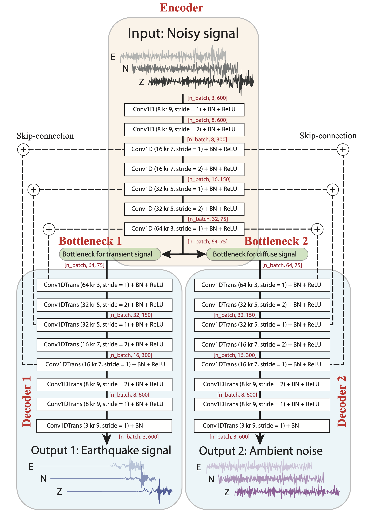
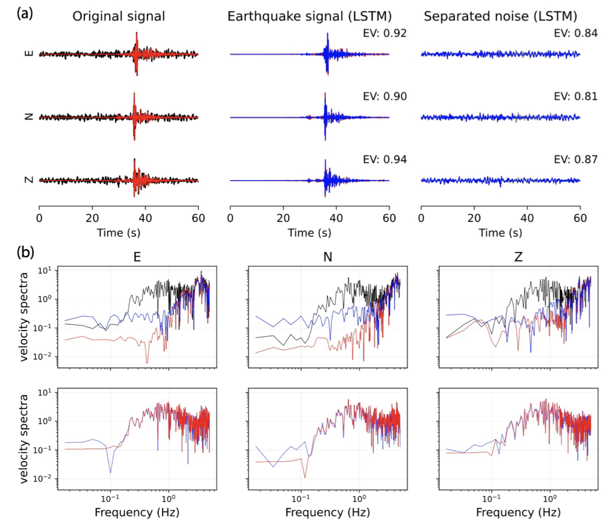
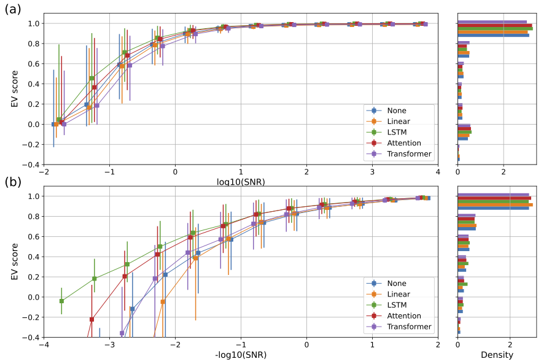
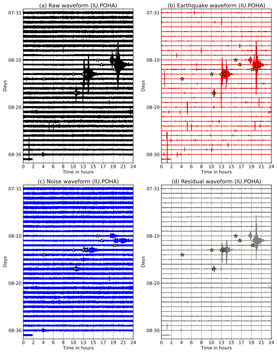

# WaveDecompNet

A machine learning tool to separate earthquake and ambient noise signals for the seismic data in time domain.

 

Step 1: Download the event catalog based on distance range to a given station 

Step 2: 

2a - Download continuous seismic data

2b - Get the STEAD earthquake waveform data with SNR > 40dB and stack with STEAD noise signals

2c - Shuffle the phase of continuous data from a given station to get the local ambient noise signals, then stack with 
the STEAD earthquake waveform.

2d - Combine the waveforms datasets from 2b and 2c to get the final datasets that will be used to train the 
WaveDecompNet.

Step 3: Training the WaveDecompNet using the prepared datasets with specified bottleneck. Because of the internal 
randomness of ML algorithm, the searching paths for optimal parameters may be slightly different when repeating the 
execution. Multiple run of the model training is recommended (just change the first i_run for-loop) but there are little 
different in the final results.
(Trained models can be found in the folder [/Model_and_datasets_1D_all_snr_40](https://github.com/yinjiuxun/WaveDecompNet/tree/stable/Model_and_datasets_1D_all_snr_40))

Step 4: Test the trained model with the test datasets, and output the comparisons of waveforms in time domain and 
frequency domain.

Step 5: Load models with different bottlenecks and compare how well they can reconstruct the waveforms by calculating 
explained variance (EV) score.

Step 6: Apply the trained model directly to the continuous seismic data to separate the earthquake and ambient noise 
signals.

Step 7: 

7a - Applying the STA/LTA to the decomposed earthquake signals 

7b - Applying the signal station cross-correlation 
to the decomposed ambient noise signals.